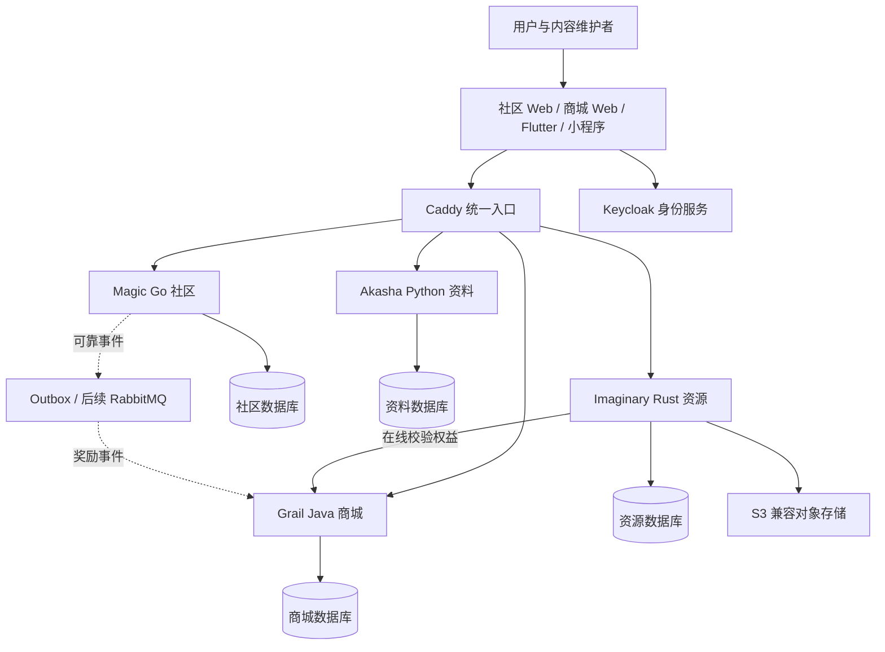
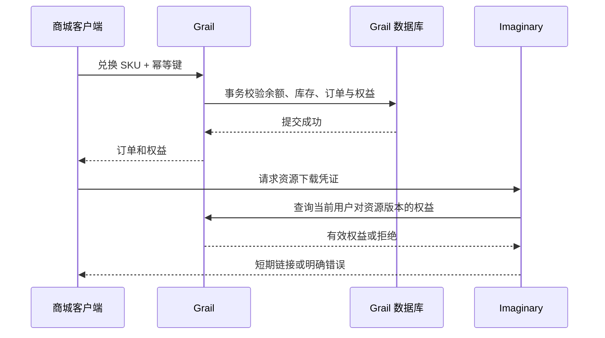

# 总体架构

状态：设计基线，业务服务待实现。目标是让多语言承担清晰的业务责任，并保持每个阶段可独立交付。

## 1. 上下文与部署边界

图中的数据库是逻辑隔离边界，开发环境允许共用 PostgreSQL 实例；各服务及身份系统使用独立库和凭据。读写权限由数据库角色约束，不能通过共享超级用户绕过边界。

业务 API 优先 HTTP + JSON。服务发现初期使用 Compose DNS；入口使用静态路由。不为四个服务提前引入服务网格、注册中心或完整 API 管理平台。

## 2. 服务职责与依赖方向

| 服务 | 负责 | 不负责 | 同步依赖 |
| --- | --- | --- | --- |
| Magic | 社区资料、分区、圈子、帖子、评论、关注、审核 | 订单账本、资料版本、资源原件 | 身份公钥；必要时查询资料摘要与内容权益 |
| Akasha | 实体、世界线、修订、来源、关联、导入与检索 | 管理社区帖子和授予商品权益 | 身份公钥；资源上传接口 |
| Grail | 商品、整数积分、库存、订单、退款、权益 | 自己托管文件、代替其他服务处理审核 | 身份公钥；发布商品时查询资源版本 |
| Imaginary | 资源清单、上传隔离、处理、版本、预览、受控分发 | 决定积分奖励或商品售价 | Grail 权益查询、对象存储 |
| Circuit | 统一身份接入规则、公共契约、日志、部署和工程能力 | 汇集所有领域逻辑 | 成熟基础组件 |

正式运行中不允许调用链无限扩张。论坛基础阅读不需要商城或资源处理服务成功；资料展示可以使用已发布摘要。下游失败时，标记关联内容暂不可用，不能让整个页面持续等待。

关键写入保持在所属服务的一个数据库事务中。跨域合作通过 API 或可恢复事件进行，不采用跨库写事务。初期不把 Grail 再拆成积分、库存和订单服务。

## 3. 各服务内部结构

统一概念包括传输层、应用用例、业务规则、持久化和外部适配器；目录与具体抽象遵循各语言惯例。

- 传输层负责协议解析、认证上下文、字段校验和响应映射，不直接编写交易规则。
- 应用层组织用例、事务边界和依赖调用；业务约束集中在所属模块。
- 持久化层维护查询、数据库约束和迁移；外部适配器隔离身份、对象存储和消息客户端。
- 共享包仅存稳定且实际复用的能力，不创建跨服务的通用业务实体包。

不为简单读取强制堆叠接口和映射层。复杂度达到需要时再引入完整领域模型；有明确约束的积分和订单应从一开始有状态机与不变量。

## 4. 关键场景

### 社区与资料关联

资料使用稳定实体 ID，帖子保存实体引用，不复制整份资料。展示可以读取公开摘要；资料下架或权限变化后不得通过旧摘要泄漏受限正文。跨域搜索索引是可重建投影，返回结果前仍校验可见性。

### 社区奖励积分

Magic 在帖子首次满足奖励条件时生成业务事件，与本地状态写入同一事务。发布任务重试不能生成新的奖励业务键。Grail 在本地事务内登记已处理业务键并记账。事件 ID 去重和奖励规则的业务键去重都需要保留，避免同一帖子被重复审核后再次奖励。

### 兑换与资源使用

资源分发失败不回滚已完成兑换；客户端可以重试获取资源。若资源永久不可用，由运营退款用例处理。商品不得引用尚未审核发布或内容不完整的资源版本。

## 5. 身份与授权

使用同一身份域和稳定用户标识，各 Web 应用有独立 OIDC client 和会话。GitHub 是可选的上游登录来源，本地账号满足离线配置的演示要求。跨应用登录通过身份服务 SSO 完成，不共享可被任意脚本读取的长期令牌。

Web 采用服务端会话／BFF 模式，Cookie 使用 HttpOnly、Secure 和合适的 SameSite，状态变更请求防护 CSRF。移动端采用系统浏览器授权码 + PKCE，令牌写入平台安全存储。小程序登录必须由服务端验证平台凭证并显式绑定统一用户，不能直接信任客户端传入的平台用户 ID。

身份服务只证明身份与基础声明，业务服务仍检查圈子权限、资源归属和账号限制。服务间身份使用独立凭据与最小权限，不复用管理员或普通用户令牌；验签检查 issuer、audience、有效期及允许的算法。

## 6. 扩展与替换

新增业务先在现有边界内评估，不用“要学习一个框架”直接增加跨域写入点。新技术可以在独立实验或清晰适配器中验证，再决定是否迁移正式能力。

替换框架不默认替换领域数据；替换存储需要数据导出、导入和校验方案。API 与事件采用兼容扩展，旧客户端有明确支持窗口。共享入口与健康检查的变化应同时更新部署和故障恢复说明。

## 7. 设计待验证项

中文搜索质量、单机资源开销、Keycloak 多端登录、对象存储 S3 兼容、资源包处理沙箱及离线权益行为需要在对应实现阶段验证。M0 提供设计与用例，不宣称这些路径已经通过运行验证。
